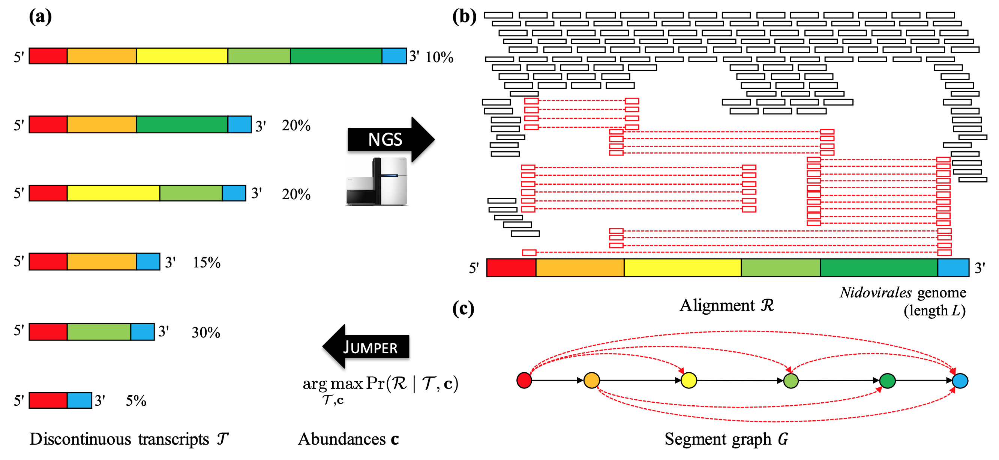

# Jumper

(a) Viruses in the order Nidovirales generate a set  of discontinuous transcripts with varying abundances  during infection.
(b) Next generation sequencing will produce an alignment  with two types of aligned reads: unphased reads that map to a contiguous genomic region (black) and phased reads that map to distinct genomic regions (red).
(c) From  we obtain the segment graph , a directed acyclic graph with a unique Hamiltonian path. Jumper solves the Discontinuous Transciption Assembly problem to infer  and  with maximum likelihood.

## Contents

  1. [Pre-requisites](#pre-requisites)
  2. [Usage instcructions](#usage)
     * [I/O formats](#io)
     * [Jumper](#jumper)
     * [simulation](#simulation)

## Pre-requisites
+ python3 (>=3.6)
+ [pysam](https://pysam.readthedocs.io/en/latest/)
+ [pandas](https://pandas.pydata.org/pandas-docs/stable/index.html)
+ [gurobipy](https://www.gurobi.com/documentation/9.0/quickstart_mac/py_python_interface.html)

## Usage instructions

### I/O formats
The input for Jumper is bam file containing the sequencing data and a fasta file containing the reference genome.
